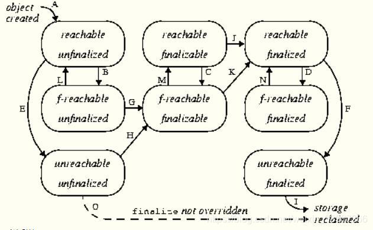

一、final
1.final关键字可以用来修饰类、方法、变量。各有不同。

A、修饰类(class)。
     1、该类不能被继承。
     2、类中的方法不会被覆盖（重写），因此默认都是final的。
     3、用途：设计类时，如果该类不需要有子类，不必要被扩展，类的实现细节不允许被改变，那么就设计成final类

B、修饰方法(method)
     1、该方法可以被继承，但是不能被覆盖。
     2、用途：一个类不允许子类覆盖该方法，则用final来修饰
     3、好处：可以防止继承它的子类修改该方法的意义和实现；更为高效，编译器在遇到调用fianal方法转入内嵌机制，提高了执行效率。
     4、注意：父类中的private成员方法不能被子类覆盖，因此，private方法默认是final型的(可以查看编译后的class文件)

C、修饰变量(variable)
     1、用final修饰后变为常量。包括静态变量、实例变量和局部变量这三种。
     2、特点：可以先声明，不给初值，这种叫做final空白。但是使用前必须被初始化。一旦被赋值，将不能再被改变。

D、修饰参数(arguments)
     1、用final修饰参数时，可以读取该参数，但是不能对其作出修改

2、final关键字不能用来抽象类和接口。

二、finalize
Java 技术允许使用 finalize() 方法在垃圾收集器将对象从内存中清除出去之前做必要的清理工作。
这个方法是由垃圾收集器在确定这个对象没有被引用时对这个对象调用的，但是什么时候调用 finalize 没有保证。

finalize的执行过程(生命周期)

(1) 首先，大致描述一下finalize流程：当对象变成(GC Roots)不可达时，GC会判断该对象是否覆盖了finalize方法，若未覆盖，则直接将其回收。否则，若对象未执行过finalize方法，将其放入F-Queue队列，由一低优先级线程执行该队列中对象的finalize方法。执行finalize方法完毕后，GC会再次判断该对象是否可达，若不可达，则进行回收，否则，对象“复活”。

(2) 具体的finalize流程：

对象可由两种状态，涉及到两类状态空间，一是终结状态空间 F = {unfinalized, finalizable, finalized}；二是可达状态空间 R = {reachable, finalizer-reachable, unreachable}。各状态含义如下：

unfinalized: 新建对象会先进入此状态，GC并未准备执行其finalize方法，因为该对象是可达的

finalizable: 表示GC可对该对象执行finalize方法，GC已检测到该对象不可达。正如前面所述，GC通过F-Queue队列和一专用线程完成finalize的执行

finalized: 表示GC已经对该对象执行过finalize方法

reachable: 表示GC Roots引用可达

finalizer-reachable(f-reachable)：表示不是reachable，但可通过某个finalizable对象可达

unreachable：对象不可通过上面两种途径可达

(1)新建对象首先处于[reachable, unfinalized]状态(A)

(2)随着程序的运行，一些引用关系会消失，导致状态变迁，从reachable状态变迁到f-reachable(B, C, D)或unreachable(E, F)状态

(3)若JVM检测到处于unfinalized状态的对象变成f-reachable或unreachable，JVM会将其标记为finalizable状态(G,H)。若对象原处于[unreachable, unfinalized]状态，则同时将其标记为f-reachable(H)。

(4)在某个时刻，JVM取出某个finalizable对象，将其标记为finalized并在某个线程中执行其finalize方法。由于是在活动线程中引用了该对象，该对象将变迁到(reachable, finalized)状态(K或J)。该动作将影响某些其他对象从f-reachable状态重新回到reachable状态(L, M, N)

(5)处于finalizable状态的对象不能同时是unreahable的，由第4点可知，将对象finalizable对象标记为finalized时会由某个线程执行该对象的finalize方法，致使其变成reachable。这也是图中只有八个状态点的原因

(6)程序员手动调用finalize方法并不会影响到上述内部标记的变化，因此JVM只会至多调用finalize一次，即使该对象“复活”也是如此。程序员手动调用多少次不影响JVM的行为

(7)若JVM检测到finalized状态的对象变成unreachable，回收其内存(I)

(8)若对象并未覆盖finalize方法，JVM会进行优化，直接回收对象（O）

(9)注：System.runFinalizersOnExit()等方法可以使对象即使处于reachable状态，JVM仍对其执行finalize方法

三.finally
1.如何实现finally总被执行
将finally中的代码块复制到try以及catch代码块中

2.finally任何情况下都会执行吗
不是的，以下情况finally不会执行
jvm停止运行
比如调用system.exit()或者Runtime.getRuntime().halt();

执行try或catch代码的线程被中断或杀死
比如守护线程刚开始执行到 finally 代码块，此时没有任何其他非守护线程，那么虚拟机将退出，此时 JVM 不会等待守护线程的 finally 代码块执行完成

try代码块中无限循环或者执行不到try代码块

3.finally的执行顺序
finally语句块是在return执行后，返回前执行的，在循环被跳过（continue）和中断（break）之前被执行的。

1、不管有没有出现异常，finally块中代码都会执行；
2、当try和catch中有return时，finally仍然会执行；
3、finally是在return后面的表达式运算后执行的（此时并没有返回运算后的值，而是先把要返回的值保存起来，不管finally中的代码怎么样，返回的值都不会改变，任然是之前保存的值），所以函数返回值是在finally执行前确定的；
4、finally中最好不要包含return，否则程序会提前退出，返回值不是try或catch中保存的返回值。
举例：
情况1：try{} catch(){}finally{} return;
显然程序按顺序执行。

情况2:try{ return; }catch(){} finally{} return;
程序执行try块中return之前（包括return语句中的表达式运算）代码；
再执行finally块，最后执行try中return;
finally块之后的语句return，因为程序在try中已经return所以不再执行。

情况3:try{ } catch(){return;} finally{} return;
程序先执行try，如果遇到异常执行catch块，
有异常：则执行catch中return之前（包括return语句中的表达式运算）代码，再执行finally语句中全部代码，
最后执行catch块中return. finally之后也就是4处的代码不再执行。
无异常：执行完try再finally再return.

情况4:try{ return; }catch(){} finally{return;}
程序执行try块中return之前（包括return语句中的表达式运算）代码；
再执行finally块，因为finally块中有return所以提前退出。

情况5:try{} catch(){return;}finally{return;}
程序执行catch块中return之前（包括return语句中的表达式运算）代码；
再执行finally块，因为finally块中有return所以提前退出。

情况6:try{ return;}catch(){return;} finally{return;}
程序执行try块中return之前（包括return语句中的表达式运算）代码；
有异常：执行catch块中return之前（包括return语句中的表达式运算）代码；
则再执行finally块，因为finally块中有return所以提前退出。
无异常：则再执行finally块，因为finally块中有return所以提前退出。

最终结论：任何执行try 或者catch中的return语句之前，都会先执行finally语句，如果finally存在的话。
如果finally中有return语句，那么程序就return了，所以finally中的return是一定会被return的，
编译器把finally中的return实现为一个warning。

四.String、StringBuffer与StringBuilder的区别？
第一点: 可变和适用范围。String对象是不可变的，而StringBuffer和StringBuilder是可变字符序列。
每次对String的操作相当于生成一个新的String对象，而对StringBuffer和StringBuilder的操作是对对象本身的操作，
而不会生成新的对象，所以对于频繁改变内容的字符串避免使用String，因为频繁的生成对象将会对系统性能产生影响。

第二点: 线程安全。String由于有final修饰，是immutable的，安全性是简单而纯粹的。
StringBuilder和StringBuffer的区别在于StringBuilder不保证同步，也就是说如果需要线程安全需要使用StringBuffer，不需要同步的StringBuilder效率更高。

五.接口与抽象类的区别？
一个子类只能继承一个抽象类, 但能实现多个接口
抽象类可以有构造方法, 接口没有构造方法
抽象类可以有普通成员变量, 接口没有普通成员变量
抽象类和接口都可有静态成员变量, 抽象类中静态成员变量访问类型任意，接口只能public static final(默认)
抽象类可以没有抽象方法, 抽象类可以有普通方法；接口在JDK8之前都是抽象方法，在JDK8可以有default方法，在JDK9中允许有私有普通方法
抽象类可以有静态方法；接口在JDK8之前不能有静态方法，在JDK8中可以有静态方法，且只能被接口类直接调用（不能被实现类的对象调用）
抽象类中的方法可以是public、protected; 接口方法在JDK8之前只有public abstract，在JDK8可以有default方法，在JDK9中允许有private方法

六.this() & super()在构造方法中的区别？
调用super()必须写在子类构造方法的第一行, 否则编译不通过
super从子类调用父类构造, this在同一类中调用其他构造均需要放在第一行
尽管可以用this调用一个构造器, 却不能调用2个
this和super不能出现在同一个构造器中, 否则编译不通过
this()、super()都指的对象,不可以在static环境中使用
本质this指向本对象的指针。super是一个关键字

七.Java移位运算符？
java中有三种移位运算符

1.<< :左移运算符,x << 1,相当于x乘以2(不溢出的情况下),低位补0
2.>>:带符号右移,x >> 1,相当于x除以2,正数高位补0,负数高位补1
3.>>> :无符号右移,忽略符号位,空位都以0补

八.泛型
1.泛型方法如何定义使用

2.调用泛型方法语法格式

说明一下，定义泛型方法时，必须在返回值前边加一个，来声明这是一个泛型方法，持有一个泛型T，然后才可以用泛型T作为方法的返回值。

Class的作用就是指明泛型的具体类型，而Class类型的变量c，可以用来创建泛型类的对象。

为什么要用变量c来创建对象呢？既然是泛型方法，就代表着我们不知道具体的类型是什么，也不知道构造方法如何，因此没有办法去new一个对象，但可以利用变量c的newInstance方法去创建对象，也就是利用反射创建对象。

泛型方法要求的参数是Class类型，而Class.forName()方法的返回值也是Class，因此可以用Class.forName()作为参数。其中，forName()方法中的参数是何种类型，返回的Class就是何种类型。在本例中，forName()方法中传入的是User类的完整路径，因此返回的是Class类型的对象，因此调用泛型方法时，变量c的类型就是Class，因此泛型方法中的泛型T就被指明为User，因此变量obj的类型为User。

当然，泛型方法不是仅仅可以有一个参数Class，可以根据需要添加其他参数。

为什么要使用泛型方法呢？ 因为泛型类要在实例化的时候就指明类型，如果想换一种类型，不得不重新new一次，可能不够灵活；而泛型方法可以在调用的时候指明类型，更加灵活

3.如何理解Java中的泛型是伪泛型？
泛型中类型擦除 Java泛型这个特性是从JDK 1.5才开始加入的，因此为了兼容之前的版本，Java泛型的实现采取了“伪泛型”的策略，即Java在语法上支持泛型，但是在编译阶段会进行所谓的“类型擦除”（Type Erasure），将所有的泛型表示（尖括号中的内容）都替换为具体的类型（其对应的原生态类型），就像完全没有泛型一样。
————————————————

